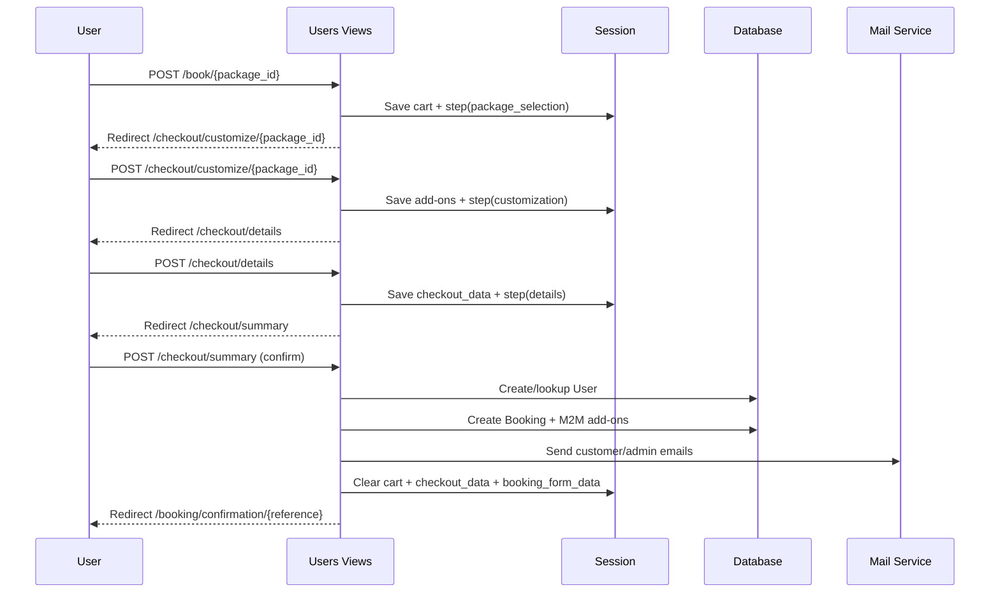

# Travel Booking System

## 1) Scope and Current Architecture

This document describes how Novustell currently handles:

- package/trip booking (end-to-end checkout)
- hotel/accommodation selection and accommodation inquiry flow
- "get quote" style inquiry flow

The implementation is split across:

- **Discovery/catalog:** `adminside` app (`Destination`, `Package`, `Accommodation`, `TravelMode`)
- **Booking + inquiries:** `users` app (`Booking`, checkout views, inquiry forms/models, email tasks)

Primary booking path is the **modern checkout flow** in `users/checkout_views.py`.

## 2) Core Domain Models

### Catalog (`adminside/models.py`)

- **Destination**
  - Hierarchical: country -> city -> place
  - Used by package and accommodation filtering
- **Package**
  - Main trip product with prices and duration
  - Key fields: `adult_price`, `child_price`, `duration_days`, `duration_nights`, `status`
  - Many-to-many to available `Accommodation` and `TravelMode`
- **Accommodation**
  - Hotel/lodge/resort style option
  - Key pricing: `price_per_room_per_night`
- **TravelMode**
  - Transport option with `price_per_person`

### Booking + Inquiry (`users/models.py`)

- **Booking** (modern booking record)
  - Stores guest identity, selected package, add-ons, price breakdown, status
  - Links to `selected_accommodations` and `selected_travel_modes`
  - Auto-generates `booking_reference` like `NVT1234567`
  - Status lifecycle: `pending`, `confirmed`, `cancelled`, `completed`
- **UserBookings** (legacy booking model)
  - Older login-required booking flow
- **ContactInquiry** and specialized inquiry models
  - `MICEInquiry`, `StudentTravelInquiry`, `NGOTravelInquiry`
  - Used for manual quote and service consultation flows

## 3) User-Facing Entry Points

### Trip booking entry points

- `GET /adminside/user-packages/` -> browse packages
- `GET /adminside/packages/<slug>/` -> package detail
- `GET|POST /book/<package_id>/` -> modern checkout step 1

### Hotel/accommodation entry points

- `GET /adminside/accommodations/` -> list accommodations
- `GET /adminside/accommodations/<slug>/` -> accommodation detail
- Accommodation detail CTA routes user to `GET|POST /contactus/` for booking/availability inquiry

### Quote/inquiry entry points

- `GET|POST /contactus/` (general inquiry with subject categories incl. "Accommodation", "Holiday Packages")
- `GET|POST /mice/`
- `GET|POST /student-travel/`
- `GET|POST /ngo-travel/`

Note: Homepage has a **"Get Quote"** label in destination cards when no starting price is available, but that label is display-only (no direct backend quote action).

## 4) Modern Trip Booking Flow (Primary Production Path)

Implemented in `users/checkout_views.py`.

### Step 1: Select package + traveler counts

- **URL:** `POST /book/<package_id>/`
- **View:** `add_to_cart`
- Validates package is `published`
- Reads form fields: `adults`, `children`, `rooms`
- Persists to:
  - Session cart (`CART_SESSION_ID`, default key `cart`)
  - Form persistence session store (`booking_form_data`, step `package_selection`)
- Redirects to step 2

### Step 2: Customize trip (accommodation + transport)

- **URL:** `POST /checkout/customize/<package_id>/`
- **View:** `checkout_customize`
- Pulls package-specific options:
  - `package.available_accommodations.filter(is_active=True)`
  - `package.available_travel_modes.filter(is_active=True)`
- Saves selected:
  - `accommodations[]`
  - `travel_modes[]`
  - `custom_accommodation` (free text)
  - `self_drive` (boolean)
- Persists to:
  - Session cart item data
  - Form persistence (`booking_form_data`, step `customization`)
- Redirects to step 3

### Step 3: Traveler/contact details

- **URL:** `POST /checkout/details/`
- **View:** `checkout_details`
- Validates `CheckoutForm` (`users/checkout_forms.py`)
  - Required: `full_name`, `email`, `phone_number`, `terms_accepted`
  - Optional: `travel_date`, `special_requests`, `marketing_consent`
- Persists to:
  - Legacy session key `checkout_data` (compat path)
  - Form persistence (`booking_form_data`, step `details`)
- Redirects to step 4

### Step 4: Review + confirm

- **URL:** `GET|POST /checkout/summary/`
- **View:** `checkout_summary`
- GET renders review from:
  - cart items + computed total
  - `checkout_data`
- POST confirm:
  1. Calls `create_booking_from_cart(cart, checkout_data)`
  2. Sends customer confirmation + admin notification emails
  3. Clears cart + checkout session data
  4. Redirects to confirmation page

### Step 5: Confirmation page

- **URL:** `GET /booking/confirmation/<booking_reference>/`
- **View:** `booking_confirmation`
- Loads booking and displays:
  - booking reference
  - package and traveler summary
  - current status
  - WhatsApp follow-up link

## 5) Pricing Logic (Current Backend Implementation)

Used in `Cart.get_total_price()` and `create_booking_from_cart()`:

- **Package base:**
  - `adult_price * adults`
  - plus children at `70%` of adult price
- **Accommodation add-on:**
  - `price_per_room_per_night * rooms * package.duration_days`
- **Travel add-on:**
  - `price_per_person * (adults + children)`
  - skipped in cart total when `self_drive=True`

Final booking amount stored in `Booking.total_amount`, with component fields:

- `package_price`
- `accommodation_price`
- `travel_price`

## 6) User Account Handling During Booking

In `create_booking_from_cart`:

- System attempts to match existing Django user by booking email.
- If no user exists:
  - creates user automatically
  - generates unique username from email
  - generates random 12-char password
  - sends welcome email with credentials
- Booking is linked to the user if available.
- If user creation fails, booking still proceeds with `user=None`.

## 7) Email Workflow

### Booking emails (`users/checkout_views.py`)

- Customer confirmation: `send_booking_confirmation_email`
- Admin alert: `send_admin_notification_email`
- New account welcome: `send_welcome_email`

### Inquiry emails (`users/tasks.py`, Mailtrap API)

- Contact inquiry -> admin + user confirmation
- MICE/student/NGO inquiry -> internal notification(s) + user confirmation

## 8) Hotel Booking and Quote Process

There are two practical hotel-related flows:

### A) Hotel as part of trip package booking

- User books a package, then picks accommodation in checkout step 2.
- Accommodation is persisted on the final `Booking` via `selected_accommodations`.
- Pricing is included in booking total per formula above.

### B) Standalone hotel inquiry ("quote/availability" style)

- User browses accommodation detail page (`/adminside/accommodations/<slug>/`).
- CTA sends user to `/contactus/`.
- User selects subject (e.g. `Accommodation`) and submits requirements.
- System creates `ContactInquiry`, sends internal + customer acknowledgment emails.
- Follow-up/quotation is manual by travel consultants (no automated quote object/API in current code).

## 9) Legacy Booking Flow (Still Present)

Older path in `users/views.py`:

- `GET|POST /bookings/<package_id>/` (`@login_required`)
- Saves into `UserBookings` model
- Sends admin email via direct SMTP (`smtplib`)
- Redirects to simple `booking_success` page

This flow coexists with modern checkout but appears to be legacy/deprecated relative to `Booking`.

## 10) Session and State Management

Main session keys:

- `cart` (configurable by `CART_SESSION_ID`)
  - stores traveler counts, selected add-ons, custom accommodation, self-drive flag
- `checkout_data`
  - stores validated details form payload
- `booking_form_data`
  - step-wise persistence helper (`FormDataManager`)

State is cleared after successful booking confirmation.

## 11) Admin Operations

- Bookings are managed in Django admin via `BookingAdmin` (`users/admin.py`).
- Admin can review/modify:
  - status
  - selected options
  - pricing fields
  - guest details
- Inquiries are also visible in admin (`ContactInquiryAdmin`, etc.).

## 12) Current Gaps / Behavioral Risks Observed

The following are important implementation notes from code inspection:

1. **Duplicate booking confirmation send path**
   - `create_booking_from_cart()` sends confirmation, and `checkout_summary()` sends again after booking creation.

2. **Single-booking persistence despite cart supporting multiple items**
   - `create_booking_from_cart()` only processes `cart_items[0]`.

3. **Pricing display vs backend mismatch**
   - Review template uses `duration_nights` for accommodation and adults-only travel math in places.
   - Backend booking calc uses `duration_days` and `(adults + children)` for travel.

4. **Potential missing route usage**
   - Checkout redirects to `users:all_packages` in empty-cart cases, but this route is not defined in current `users/urls.py`.

5. **"Get Quote" label not wired to quote action**
   - Present in homepage destination card fallback UI but no direct submit/redirect for automated quote capture.

## 13) End-to-End Sequence (Modern Booking)

## 14) Practical Interpretation for Product/Operations

- **Trip booking is automated** through a multi-step checkout and persists a concrete `Booking`.
- **Hotel-only booking is inquiry-driven** (manual quote/fulfillment) via contact flow.
- **Quote process is mostly inquiry-based**, not a dedicated computational quote engine/API at this time.

